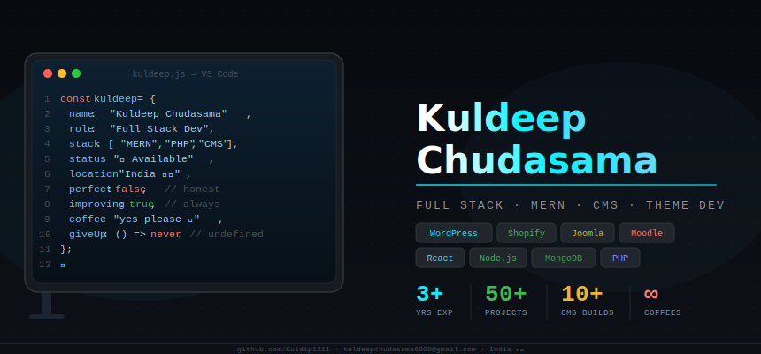

<div align="center">

<!-- UNIQUE DEV HERO SVG -->


<br/>

<!-- TYPING SUBTITLE -->


<br/><br/>

<!-- BADGES -->

&nbsp;

&nbsp;


</div>

---

## 💬 My Daily Standup

| # | Question | Answer |
|:-:|:---------|:-------|
| ✅ | What did you do yesterday? | Googled how to center a div... again |
| ✅ | What will you do today? | Push to `main` and pray 🙏 |
| ❌ | Any blockers? | Yes. Stack Overflow is down |
| 🤔 | ETA on the fix? | "It's almost done" *(since 3 days)* |

---

## 👨‍💻 About Me

- 🔭 &nbsp; Full Stack Developer — **MERN + PHP + CMS**
- 🎨 &nbsp; Expert in **WordPress, Shopify, Joomla, Moodle** theme development
- ⚡ &nbsp; I build **scalable web apps** and **custom CMS solutions**
- 🌱 &nbsp; Currently learning **Docker · CI/CD · AWS · System Design**
- 💼 &nbsp; Open to **Freelance** and **Full-time** opportunities
- 📍 &nbsp; Based in **India 🇮🇳**
- ☕ &nbsp; `while(alive) { code(); drinkCoffee(); }`
- 😅 &nbsp; **`perfect = false`** but **`improving = true`** — always

---

## ⚡ Tech Arsenal

<div align="center">

### 🟨 Languages


| Skill | Bar | Level |
|:------|:---:|------:|
| JavaScript | `████████████████░░░░` | **Advanced** 80% |
| PHP | `█████████████░░░░░░░` | **Intermediate+** 65% |
| TypeScript | `████████████░░░░░░░░` | **Intermediate** 60% |
| Java | `████████░░░░░░░░░░░░` | **Familiar** 40% |

---

### ⚛️ Frontend


| Skill | Bar | Level |
|:------|:---:|------:|
| HTML5 / CSS3 | `██████████████████░░` | **Expert** 90% |
| React.js | `████████████████░░░░` | **Advanced** 80% |
| Bootstrap | `████████████████░░░░` | **Advanced** 80% |
| Redux / Recoil | `█████████████░░░░░░░` | **Intermediate+** 65% |

---

### 🖥️ Backend & Database


| Skill | Bar | Level |
|:------|:---:|------:|
| Node.js | `████████████████░░░░` | **Advanced** 80% |
| Express.js | `████████████████░░░░` | **Advanced** 80% |
| MongoDB | `██████████████░░░░░░` | **Intermediate+** 70% |

---

### 🧩 CMS & Theme Development


| Skill | Bar | Level |
|:------|:---:|------:|
| Custom Theme Dev | `███████████████████░` | **Expert** 95% |
| WordPress | `██████████████████░░` | **Expert** 90% |
| Shopify (Liquid) | `████████████████░░░░` | **Advanced** 80% |
| Joomla | `█████████████░░░░░░░` | **Intermediate+** 65% |
| Moodle | `████████████░░░░░░░░` | **Intermediate** 60% |

</div>

---

## 🤣 Dev Life in Memes

<div align="center">

<table>
<tr>
<td align="center" width="33%">

**When code works on first try**


*Happened once. In 2019.*

</td>
<td align="center" width="33%">

**Me at 2AM debugging**


*"It was just a semicolon" 😭*

</td>
<td align="center" width="33%">

**Pushing to production Friday**


*Praying to the server gods 🙏*

</td>
</tr>
</table>

</div>

---

## 📊 GitHub Dashboard

<div align="center">


<br/><br/>


</div>

---

## 📈 Contribution Graph

<div align="center">

[](https://github.com/ashutosh00710/github-readme-activity-graph)

</div>

---

## 🏆 GitHub Trophies

<div align="center">

[](https://github.com/ryo-ma/github-profile-trophy)

</div>

---

## 🐍 Contribution Snake

<div align="center">

<picture>
  <source media="(prefers-color-scheme: dark)" srcset="https://raw.githubusercontent.com/Kuldip1211/Kuldip1211/output/github-contribution-grid-snake-dark.svg"/>
  <source media="(prefers-color-scheme: light)" srcset="https://raw.githubusercontent.com/Kuldip1211/Kuldip1211/output/github-contribution-grid-snake.svg"/>
  
</picture>

</div>

---

## 😂 Honest Dev Stats

<div align="center">


</div>

<br/>

| What I Say | What I Actually Mean |
|:-----------|:---------------------|
| 🧑‍💻 "Writing clean code" | Copy-pasting from Stack Overflow |
| 🐛 "Quick bug fix" | 4 hours and 12 coffees later |
| 📝 "Adding comments" | `// TODO: fix this later` *(from 2 years ago)* |
| 🚀 "Deploying to prod" | *types nervously and closes laptop* |
| ⏰ "5 minute task" | It's been 3 days |
| 📖 "Reading the docs" | Ctrl+F → copy → paste → hope |

---

## 🌱 Currently Leveling Up

<div align="center">

| Technology | Status | Progress |
|:-----------|:------:|:---------|
| 🐳 Docker | 📖 Learning | `████░░░░░░░░░░░░░░░░` 20% |
| ⚙️ CI/CD | 📖 Exploring | `████░░░░░░░░░░░░░░░░` 20% |
| ☁️ AWS | 📖 Starting | `███░░░░░░░░░░░░░░░░░` 15% |
| 🏗️ System Design | 📖 Reading | `██████░░░░░░░░░░░░░░` 30% |

</div>

---

## 🛠️ Dev Tools

<div align="center">


</div>

---

## 🧠 Life Philosophy

```javascript
// The honest developer manifesto
const kuldeep = {
  name:      "Kuldeep Chudasama",
  role:      "Full Stack Developer",
  coffee:    () => "yes please ☕",
  code:      () => "always — even at 2AM",
  learn:     () => "every single day",
  perfect:   false,          // honest — nobody is
  improving: true,           // always — no exceptions
  giveUp:    () => never,    // this function is undefined
  mood: (bugs) => bugs > 0 ? "debugging mode 🐛" : "who are you kidding",
};

// The real developer loop
while (kuldeep.alive) {
  drinkCoffee();
  writeCode();
  encounterBug();          // always returns true
  searchStackOverflow();   // 50% of the day
  pushToGit();

  if (itWorked) {
    celebrate();           // lasts 3 seconds
  } else {
    repeat();              // lasts 3 days
  }
}

// spoiler: itWorked is almost always false on the first try
```

---

## 📡 Connect With Me

<div align="center">

[](https://www.linkedin.com/in/kuldeep-chudasama-1759b1256/)
&nbsp;
[](mailto:kuldeepchudasama6999@gmail.com)
&nbsp;
[](https://github.com/Kuldip1211)

<br/>


**Drop a message, say hi — let's build something awesome together!**

</div>

---

<div align="center">


*"Not perfect — just persistent. Every bug is a lesson. Every PR is progress."*

</div>
